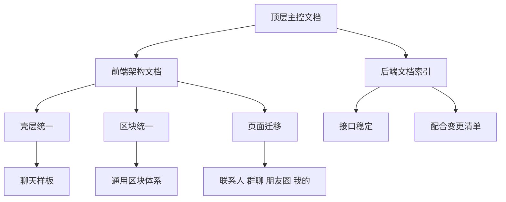

# Esy-IM 项目文档治理与整体重构主方案

## 1. 文档目的

本文档作为 [`Esy-IM`](README.md) 后续文档治理与整体重构的唯一主控文档，用于统一以下内容：

- 当前项目混乱点判断
- 新的文档信息架构
- 前端整体重构路线
- 后端配合边界
- 分阶段实施计划
- 风险与验收标准

本方案只覆盖文档与架构规划，不涉及任何 [`*.ts`](im-frontend/tsconfig.json)、[`*.tsx`](im-frontend/app/chat/page.tsx)、[`*.go`](im-backend/cmd/server/main.go) 代码修改。

---

## 2. 当前现状判断

### 2.1 项目层面的核心问题

当前项目并不是单点缺文档，而是存在文档与实现共同失序的问题：

1. 根目录、前端目录、后端目录都存在阶段性总结文档
2. 同一主题被多份文档重复描述，但粒度和结论不一致
3. 文档大量以一次性工作总结形式存在，缺少长期维护入口
4. [`README.md`](README.md) 与 [`im-frontend/README.md`](im-frontend/README.md)、[`im-backend/README.md`](im-backend/README.md) 没有形成清晰导航关系
5. 前端经历过多轮 UI 修补、页面修补、局部重构后，页面结构已有可复用苗头，但缺乏统一重构总线

### 2.2 前端文档混乱点

#### A. 架构类与总结类混写

- [`im-frontend/PAGE_REDESIGN_ARCHITECTURE.md`](im-frontend/PAGE_REDESIGN_ARCHITECTURE.md) 已经具备重构蓝图价值
- [`im-frontend/UI_OPTIMIZATION_SUMMARY.md`](im-frontend/UI_OPTIMIZATION_SUMMARY.md) 更像阶段性成果汇报，包含大量已不适合作为长期设计规范的描述
- [`im-frontend/INTEGRATION_SUMMARY.md`](im-frontend/INTEGRATION_SUMMARY.md) 与 [`im-frontend/FRONTEND_API_INTEGRATION.md`](im-frontend/FRONTEND_API_INTEGRATION.md)、[`im-frontend/API_QUICK_REFERENCE.md`](im-frontend/API_QUICK_REFERENCE.md) 存在明显重叠

#### B. 文档职责边界不清

- 有的文档描述架构原则
- 有的文档描述某次任务完成情况
- 有的文档既写现状、又写教程、又写总结
- 使用者很难判断哪一份才是当前有效版本

#### C. 文档与当前重构方向不完全一致

从已知实现看：

- [`im-frontend/components/layout/workspace-shell.tsx`](im-frontend/components/layout/workspace-shell.tsx) 已形成统一壳层基础
- [`im-frontend/components/workspace/section.tsx`](im-frontend/components/workspace/section.tsx) 已形成区块化组件方向
- [`im-frontend/app/chat/page.tsx`](im-frontend/app/chat/page.tsx) 已成为区块化页面样板

但部分历史文档仍以一次性 UI 美化、组件增强、特效补充为中心，不再适合作为整体重构依据。

### 2.3 后端文档混乱点

后端当前问题不是缺文档，而是文档数量偏多且用途交叉：

- [`im-backend/README.md`](im-backend/README.md) 兼有介绍、快速开始、API 列表、文档索引作用
- [`im-backend/API_DOCUMENTATION.md`](im-backend/API_DOCUMENTATION.md) 与 [`im-backend/MESSAGE_API_DOCUMENTATION.md`](im-backend/MESSAGE_API_DOCUMENTATION.md) 为能力文档
- [`im-backend/FEATURE_SUMMARY.md`](im-backend/FEATURE_SUMMARY.md)、[`im-backend/MESSAGE_FEATURE_SUMMARY.md`](im-backend/MESSAGE_FEATURE_SUMMARY.md)、[`im-backend/CHANGELOG.md`](im-backend/CHANGELOG.md) 更偏阶段总结
- [`im-backend/ARCHITECTURE_IMPROVEMENT.md`](im-backend/ARCHITECTURE_IMPROVEMENT.md) 提出了后端架构演进方向，但与当前前端整体重构并没有建立明确接口

### 2.4 根目录文档混乱点

根目录存在大量一次性文档：

- [`FRONTEND_BACKEND_INTEGRATION_PLAN.md`](FRONTEND_BACKEND_INTEGRATION_PLAN.md)
- [`INTEGRATION_STATUS.md`](INTEGRATION_STATUS.md)
- [`STYLE_FIX_SUMMARY.md`](STYLE_FIX_SUMMARY.md)
- [`LOGIN_UI_PERFECT_MATCH.md`](LOGIN_UI_PERFECT_MATCH.md)
- 以及多份登录页或好友请求相关修补说明

这些文档多数属于阶段交付记录，不应继续位于顶层参与日常导航。

---

## 3. 文档治理目标

新的文档体系应满足以下目标：

1. 顶层只保留长期有效入口文档
2. 架构文档、实施文档、历史归档严格分层
3. 前端与后端各自保留模块索引文档
4. 阶段性总结全部迁入各自 [`archive`](im-frontend) 语义目录
5. 后续重构工作只围绕主方案与模块索引推进，避免新增散落总结

---

## 4. 新的文档信息架构

## 4.1 顶层结构

建议将项目文档体系整理为：

```text
Esy-IM/
├── README.md
├── PROJECT_REFACTOR_MASTER_PLAN.md
├── docs-archive/
│   └── root/
├── im-frontend/
│   ├── README.md
│   ├── DOCUMENTATION_INDEX.md
│   ├── FRONTEND_REFACTOR_ARCHITECTURE.md
│   ├── API_INTEGRATION_GUIDE.md
│   ├── API_QUICK_REFERENCE.md
│   └── archive/
└── im-backend/
    ├── README.md
    ├── DOCUMENTATION_INDEX.md
    ├── API_DOCUMENTATION.md
    ├── MESSAGE_API_DOCUMENTATION.md
    ├── DEVELOPMENT.md
    └── archive/
```

说明：

- [`README.md`](README.md) 负责项目入口导航
- [`PROJECT_REFACTOR_MASTER_PLAN.md`](PROJECT_REFACTOR_MASTER_PLAN.md) 负责总方案
- [`im-frontend/DOCUMENTATION_INDEX.md`](im-frontend/DOCUMENTATION_INDEX.md) 负责前端文档导航与治理规则
- [`im-backend/DOCUMENTATION_INDEX.md`](im-backend/DOCUMENTATION_INDEX.md) 负责后端文档导航与治理规则
- 所有历史总结迁入归档目录，不再作为主导航入口

## 4.2 文档角色定义

### A. 顶层主控文档

- [`README.md`](README.md)
  - 项目概览
  - 前后端启动入口
  - 主文档导航
- [`PROJECT_REFACTOR_MASTER_PLAN.md`](PROJECT_REFACTOR_MASTER_PLAN.md)
  - 唯一重构总方案
  - 统一阶段和验收口径

### B. 前端长期有效文档

- [`im-frontend/README.md`](im-frontend/README.md)
  - 前端启动方式与目录说明
- [`im-frontend/DOCUMENTATION_INDEX.md`](im-frontend/DOCUMENTATION_INDEX.md)
  - 前端文档导航
  - 保留文档与归档文档说明
- [`im-frontend/FRONTEND_REFACTOR_ARCHITECTURE.md`](im-frontend/FRONTEND_REFACTOR_ARCHITECTURE.md)
  - 页面壳层、区块组件、页面模式、迁移原则
- [`im-frontend/API_INTEGRATION_GUIDE.md`](im-frontend/API_INTEGRATION_GUIDE.md)
  - 当前有效前端对接文档
- [`im-frontend/API_QUICK_REFERENCE.md`](im-frontend/API_QUICK_REFERENCE.md)
  - 速查手册

### C. 后端长期有效文档

- [`im-backend/README.md`](im-backend/README.md)
- [`im-backend/DOCUMENTATION_INDEX.md`](im-backend/DOCUMENTATION_INDEX.md)
- [`im-backend/API_DOCUMENTATION.md`](im-backend/API_DOCUMENTATION.md)
- [`im-backend/MESSAGE_API_DOCUMENTATION.md`](im-backend/MESSAGE_API_DOCUMENTATION.md)
- [`im-backend/DEVELOPMENT.md`](im-backend/DEVELOPMENT.md)

### D. 历史归档文档

原则：

- 一次性总结
- 阶段任务回顾
- 版本性状态记录
- 已被主文档吸收的设计说明

全部进入 [`docs-archive/root`](docs-archive/root)、[`im-frontend/archive`](im-frontend/archive)、[`im-backend/archive`](im-backend/archive)。

---

## 5. 保留、合并、归档、重命名建议

## 5.1 根目录文档处理建议

| 当前文档 | 建议动作 | 原因 |
| --- | --- | --- |
| [`README.md`](README.md) | 保留并重写导航职责 | 作为唯一顶层入口 |
| [`PROJECT_REFACTOR_MASTER_PLAN.md`](PROJECT_REFACTOR_MASTER_PLAN.md) | 新增并长期维护 | 作为总方案源 |
| [`FRONTEND_BACKEND_INTEGRATION_PLAN.md`](FRONTEND_BACKEND_INTEGRATION_PLAN.md) | 归档到 [`docs-archive/root`](docs-archive/root) | 属于阶段性对接方案 |
| [`INTEGRATION_STATUS.md`](INTEGRATION_STATUS.md) | 归档到 [`docs-archive/root`](docs-archive/root) | 状态快照，不宜继续顶层保留 |
| [`STYLE_FIX_SUMMARY.md`](STYLE_FIX_SUMMARY.md) | 归档到 [`docs-archive/root`](docs-archive/root) | 一次性修补记录 |
| [`LOGIN_HORIZONTAL_LAYOUT_FIX.md`](LOGIN_HORIZONTAL_LAYOUT_FIX.md) 等登录修补文档 | 归档到 [`docs-archive/root`](docs-archive/root) | 高度阶段性、不可作为长期规范 |
| 好友请求修复相关文档 | 归档到 [`docs-archive/root`](docs-archive/root) | 专项问题记录 |

## 5.2 前端文档处理建议

| 当前文档 | 建议动作 | 原因 |
| --- | --- | --- |
| [`im-frontend/README.md`](im-frontend/README.md) | 保留但重写 | 当前仍是默认模板，未承担真实入口职责 |
| [`im-frontend/PAGE_REDESIGN_ARCHITECTURE.md`](im-frontend/PAGE_REDESIGN_ARCHITECTURE.md) | 重命名并升级为 [`im-frontend/FRONTEND_REFACTOR_ARCHITECTURE.md`](im-frontend/FRONTEND_REFACTOR_ARCHITECTURE.md) | 它最接近长期有效架构文档 |
| [`im-frontend/UI_OPTIMIZATION_SUMMARY.md`](im-frontend/UI_OPTIMIZATION_SUMMARY.md) | 归档到 [`im-frontend/archive`](im-frontend/archive) | 偏 UI 优化成果汇报，不适合作为现行规范 |
| [`im-frontend/INTEGRATION_SUMMARY.md`](im-frontend/INTEGRATION_SUMMARY.md) | 合并后归档 | 与对接指南、速查手册重复严重 |
| [`im-frontend/FRONTEND_API_INTEGRATION.md`](im-frontend/FRONTEND_API_INTEGRATION.md) | 重命名为 [`im-frontend/API_INTEGRATION_GUIDE.md`](im-frontend/API_INTEGRATION_GUIDE.md) | 命名更稳定，也便于索引 |
| [`im-frontend/API_QUICK_REFERENCE.md`](im-frontend/API_QUICK_REFERENCE.md) | 保留 | 适合作为速查型文档 |
| [`im-frontend/components/README.md`](im-frontend/components/README.md) | 保留或并入前端架构文档 | 视内容决定，但不能与主架构冲突 |
| [`im-frontend/基于现有UI资产的响应式欢迎与登录页实现.md`](im-frontend/基于现有UI资产的响应式欢迎与登录页实现.md) | 归档到 [`im-frontend/archive`](im-frontend/archive) | 主题过窄且偏阶段实现 |

## 5.3 后端文档处理建议

| 当前文档 | 建议动作 | 原因 |
| --- | --- | --- |
| [`im-backend/README.md`](im-backend/README.md) | 保留并简化为后端入口 | 应减少与其他文档的重复 |
| [`im-backend/API_DOCUMENTATION.md`](im-backend/API_DOCUMENTATION.md) | 保留 | 后端 API 主文档 |
| [`im-backend/MESSAGE_API_DOCUMENTATION.md`](im-backend/MESSAGE_API_DOCUMENTATION.md) | 保留 | 消息域专门文档仍有必要 |
| [`im-backend/DEVELOPMENT.md`](im-backend/DEVELOPMENT.md) | 保留 | 开发与架构约束文档 |
| [`im-backend/ARCHITECTURE_IMPROVEMENT.md`](im-backend/ARCHITECTURE_IMPROVEMENT.md) | 归档到 [`im-backend/archive`](im-backend/archive) 并在索引中标记为历史架构讨论 | 包含有价值意见，但不是当前统一执行主线 |
| [`im-backend/FEATURE_SUMMARY.md`](im-backend/FEATURE_SUMMARY.md) | 归档 | 功能总结型文档 |
| [`im-backend/MESSAGE_FEATURE_SUMMARY.md`](im-backend/MESSAGE_FEATURE_SUMMARY.md) | 归档 | 功能总结型文档 |
| [`im-backend/QUICKSTART.md`](im-backend/QUICKSTART.md) 与 [`im-backend/QUICKSTART_v1.1.md`](im-backend/QUICKSTART_v1.1.md) | 二选一保留，其余归档 | 快速开始不应并存多个版本 |
| [`im-backend/COMPREHENSIVE_API_TEST_SUMMARY.md`](im-backend/COMPREHENSIVE_API_TEST_SUMMARY.md) | 归档 | 测试报告性质 |

---

## 6. 目标架构

## 6.1 项目目标架构总览

本次整体重构不是立即重写前后端，而是先建立一套可持续演进的文档与页面架构。



## 6.2 前端目标架构

前端目标不是继续做零散 UI 修补，而是建立统一页面系统：

### A. 壳层统一

依托 [`im-frontend/components/layout/workspace-shell.tsx`](im-frontend/components/layout/workspace-shell.tsx) 作为统一工作区骨架。

### B. 区块统一

依托 [`im-frontend/components/workspace/section.tsx`](im-frontend/components/workspace/section.tsx) 建立可复用区块语义，例如：

- 页面区块标题
- 列表区块
- 表单区块
- 详情区块
- 空状态区块
- 操作区块

### C. 页面模式统一

以 [`im-frontend/app/chat/page.tsx`](im-frontend/app/chat/page.tsx) 现有区块化思路作为样板，统一迁移：

- [`im-frontend/app/contacts/page.tsx`](im-frontend/app/contacts/page.tsx)
- [`im-frontend/app/groups/page.tsx`](im-frontend/app/groups/page.tsx)
- [`im-frontend/app/moments/page.tsx`](im-frontend/app/moments/page.tsx)
- [`im-frontend/app/me/page.tsx`](im-frontend/app/me/page.tsx)

### D. 组件职责统一

- 壳层组件负责布局，不负责具体业务细节
- 页面区块组件负责结构表达，不直接耦合复杂数据请求
- 业务组件负责领域显示，不再把全部内容塞入页面文件

## 6.3 后端目标配合架构

后端在本轮重构中不作为主战场，但需要承担稳定接口提供者角色：

1. 保持 API 协议稳定
2. 明确当前已知接口缺陷与数据边界
3. 对影响前端重构的关键问题形成配合清单
4. 非必要不在本阶段同步做大规模后端架构翻修

后端是否需要配合：需要，但应控制在支持前端重构落地的最小范围。

重点配合项来自现有对接文档中反复出现的问题：

- 朋友圈 ID 序列化一致性
- 参数校验一致性
- 好友关系建立链路验证
- WebSocket 行为稳定性

---

## 7. 文档治理方案

## 7.1 治理原则

1. 一个主题只有一个主文档
2. 阶段性记录不能占据正式入口位置
3. 文档命名必须反映职责，而不是反映一次任务
4. 文档中必须标注适用范围与状态
5. 架构文档更新优先于总结文档新增

## 7.2 命名规则

建议统一采用以下命名方式：

- `README.md`：模块入口
- `DOCUMENTATION_INDEX.md`：文档索引与治理说明
- `*_ARCHITECTURE.md`：长期架构说明
- `*_GUIDE.md`：使用与接入指南
- `*_REFERENCE.md`：速查文档
- `archive/*.md`：历史记录与阶段总结

避免继续新增下列风格文档作为主文档：

- `*_SUMMARY.md`
- `*_FIX.md`
- `*_FINAL_FIX.md`
- `*_STATUS.md`

这类文档若必须保留，应直接归档。

## 7.3 文档生命周期

### 状态定义

- Active：当前有效主文档
- Reference：长期参考，但不是主入口
- Archive：历史记录，不参与主决策

### 维护规则

- 任何新阶段开始前，先更新 [`PROJECT_REFACTOR_MASTER_PLAN.md`](PROJECT_REFACTOR_MASTER_PLAN.md)
- 模块执行前，先更新对应 [`DOCUMENTATION_INDEX.md`](im-frontend/DOCUMENTATION_INDEX.md)
- 阶段完成后，只更新主文档状态，不再新增独立总结散文档

---

## 8. 前端重构路线

## 8.1 重构总原则

1. 先统一结构，再处理视觉细节
2. 先固化区块模式，再迁移页面
3. 先以聊天页为样板，再扩展到其余页面
4. 保持 API 层、状态层尽量稳定
5. 拒绝继续以单页面修补文档驱动开发

## 8.2 页面重构顺序

### Phase A：文档与规范归一

- 固化前端架构主文档
- 确定页面统一骨架
- 确定区块组件职责
- 确定页面迁移模板

### Phase B：样板页确认

- 复核 [`im-frontend/app/chat/page.tsx`](im-frontend/app/chat/page.tsx) 是否符合区块化样板标准
- 抽取可复制模式
- 明确哪些写法可推广，哪些仅为样板特例

### Phase C：同构页面迁移

建议顺序：

1. [`im-frontend/app/contacts/page.tsx`](im-frontend/app/contacts/page.tsx)
2. [`im-frontend/app/groups/page.tsx`](im-frontend/app/groups/page.tsx)
3. [`im-frontend/app/moments/page.tsx`](im-frontend/app/moments/page.tsx)
4. [`im-frontend/app/me/page.tsx`](im-frontend/app/me/page.tsx)

原因：

- 联系人与群聊更接近双栏信息架构
- 朋友圈与我的页面在区块表达上更依赖统一规范
- 先做结构相近页面，可降低迁移成本

### Phase D：组件与状态收口

- 对重复区块进行下沉
- 收敛通用交互模式
- 清理页面级过大 JSX
- 明确页面、区块、业务组件边界

### Phase E：文档回写与冻结

- 将最终页面模式回写到前端架构文档
- 将旧说明全部转入归档
- 形成可供后续继续重构的稳定基线

---

## 9. 后端是否需要配合

答案：需要，但以稳定支撑为目标，而不是同步重构。

## 9.1 必要配合项

1. 核对前端重构涉及的 API 是否已稳定可用
2. 列出阻断前端页面迁移的后端问题
3. 对 WebSocket、消息、好友、朋友圈关键链路给出当前有效约束
4. 若接口字段存在历史不一致，优先文档澄清，再决定是否改接口

## 9.2 不建议本轮同步展开的事项

- 大规模调整 Go 分层架构
- 在前端尚未完成页面系统统一前，全面重写消息协议
- 并行推进过多后端架构理想化改造

## 9.3 建议的后端配合输出物

后续执行阶段建议产出但不在本次操作中实现：

- 接口稳定性清单
- 前端阻断项清单
- WebSocket 行为约束清单
- 需要改动的接口差异表

---

## 10. 分阶段实施计划

## 10.1 Phase 1：文档收敛

目标：建立唯一主方案与索引入口。

交付物：

- [`PROJECT_REFACTOR_MASTER_PLAN.md`](PROJECT_REFACTOR_MASTER_PLAN.md)
- [`im-frontend/DOCUMENTATION_INDEX.md`](im-frontend/DOCUMENTATION_INDEX.md)
- [`im-backend/DOCUMENTATION_INDEX.md`](im-backend/DOCUMENTATION_INDEX.md)
- 明确归档、重命名、合并映射

## 10.2 Phase 2：前端架构定稿

目标：把现有页面设计与区块模式收敛成单一前端架构文档。

交付物：

- 前端重构架构文档
- 页面迁移模板
- 页面优先级清单

## 10.3 Phase 3：前端页面迁移实施

目标：以聊天页为样板，完成核心页面结构统一。

交付物：

- 联系人页迁移
- 群聊页迁移
- 朋友圈页迁移
- 我的页面迁移

## 10.4 Phase 4：接口配合与收口

目标：解决阻断重构落地的接口问题与状态边界问题。

交付物：

- 后端配合问题清单
- 接口差异修正清单
- 页面联调清单

## 10.5 Phase 5：验收与归档

目标：形成稳定、可维护的文档和页面体系。

交付物：

- 主文档状态更新
- 历史文档归档完成
- 最终验收记录并入主文档，而不是新增散落总结

---

## 11. 风险

## 11.1 文档风险

- 历史文档太多，迁移过程中容易再次出现双入口
- 未明确主文档优先级时，团队会继续引用旧总结文档

## 11.2 前端风险

- 页面结构统一后，可能暴露现有组件职责混乱问题
- 区块化过程中，页面短期内会出现新旧模式共存
- 聊天页样板若未先校准，会把局部历史问题复制到其它页面

## 11.3 后端风险

- 若接口返回结构存在隐性不一致，前端统一重构后问题会更集中暴露
- WebSocket 与消息链路若缺少稳定约束，聊天样板的可复制性会下降

## 11.4 过程风险

- 若继续以一次性修补需求插队，会破坏整体重构节奏
- 若文档治理不先落地，代码重构会再次积累新的文档债务

---

## 12. 验收标准

## 12.1 文档治理验收

满足以下条件才算文档体系整理完成：

- 顶层只保留长期有效入口文档
- 前端与后端各有一份索引文档
- 历史总结文档被标记为归档对象
- 架构文档与总结文档边界清晰
- 任一主题都能定位到单一主文档

## 12.2 前端重构规划验收

满足以下条件才算前端重构方案合格：

- 明确统一壳层与区块体系
- 明确页面迁移顺序
- 明确聊天页样板地位
- 明确哪些内容不在本轮处理范围
- 明确与后端的最小配合边界

## 12.3 项目总方案验收

满足以下条件才算总方案可执行：

- 有现状问题判断
- 有目标架构
- 有文档治理方案
- 有前端路线
- 有后端配合说明
- 有分阶段计划
- 有风险与验收标准

---

## 13. 建议的下一执行步骤

1. 先创建并落地 [`im-frontend/DOCUMENTATION_INDEX.md`](im-frontend/DOCUMENTATION_INDEX.md)
2. 再创建并落地 [`im-backend/DOCUMENTATION_INDEX.md`](im-backend/DOCUMENTATION_INDEX.md)
3. 依据本方案，将前端架构主文档从 [`im-frontend/PAGE_REDESIGN_ARCHITECTURE.md`](im-frontend/PAGE_REDESIGN_ARCHITECTURE.md) 升级为新命名文档
4. 统一列出应归档的根目录、前端、后端历史文档
5. 完成文档入口整理后，再切换到实现模式执行页面重构

---

## 14. 本文档的执行定位

从本文件建立开始，后续关于项目整体重构的决策，应统一以 [`PROJECT_REFACTOR_MASTER_PLAN.md`](PROJECT_REFACTOR_MASTER_PLAN.md) 为准；任何历史总结文档若与本文冲突，以本文为准。